# LOGI - Decifra.IA


Jogo educacional de terminal que une lógica proposicional e conscientização sobre Inteligência Artificial.

Desenvolvido por Squad 05 como Projeto Integrador 2P - E5 no CESAR School.

Implementado em **C** na Unidade 1 e **Haskell** na Unidade 2.

---

## Sobre o Jogo

Você está em 2031. A IA já permeia tudo: contrata, diagnostica, julga, governa. A maioria das pessoas apenas aceita as respostas que ela dá.

Mas você conheceu a **LOGI**.

LOGI não é um chatbot qualquer. Ela é uma IA tutora criada para ensinar o que poucos ainda dominam: **pensar com rigor lógico**. Ela acredita que a melhor defesa contra uma IA opaca é um humano que sabe raciocinar.

A cada sessão, LOGI te apresenta desafios de lógica proposicional, os mesmos fundamentos matemáticos que estão por trás de qualquer sistema de IA. Ela explica operadores como AND, OR, NOT, IMPLICA e BICONDICIONAL não como curiosidades acadêmicas, mas como ferramentas de pensamento crítico para o mundo que vivemos.

Entre cada desafio, ela conta um pouco sobre como a IA funciona, onde ela erra, o que ela não consegue fazer sozinha, e por que você, humano, ainda importa.

**Decifre as proposições. Questione as máquinas. Pense por conta própria.**

---

## O que o jogo ensina

### Lógica Proposicional

| Operador | Regra |
|---|---|
| `AND` | verdadeiro apenas quando ambos os lados são V |
| `OR` | verdadeiro quando pelo menos um lado é V |
| `NOT` | inverte o valor lógico |
| `IMPLICA` | falso apenas quando P = V e Q = F |
| `BICONDICIONAL` | verdadeiro quando os dois lados têm o mesmo valor |

### Conscientização em IA

O jogo aborda de forma narrativa temas como:

- Viés algorítmico — quando a IA reflete os preconceitos dos dados com que foi treinada
- Opacidade de modelos — o problema da "caixa preta" e a dificuldade de auditar decisões automáticas
- Falsas certezas — por que alta acurácia em treino não garante segurança no mundo real
- Papel humano — o lugar do pensamento crítico e da responsabilidade em sistemas híbridos

---

## Fluxo do jogo

```
Menu principal
  ├─ Jogar
  │     └─ Loading (LOGI inicializa)
  │           └─ Informe seu nome
  │                 └─ Desafio 1 → [V/F] ou [H] pedir dica ao LOGI
  │                 └─ Feedback (acerto/erro + explicação)
  │                 └─ Desafio 2 ... Desafio 5
  │                 └─ Resultado final (pontuação + classificação)
  │                 └─ Volta ao menu
  ├─ Como Jogar (regras e operadores)
  └─ Sair (animação "Até logo!")
```

---

## Screenshots

**Menu principal**

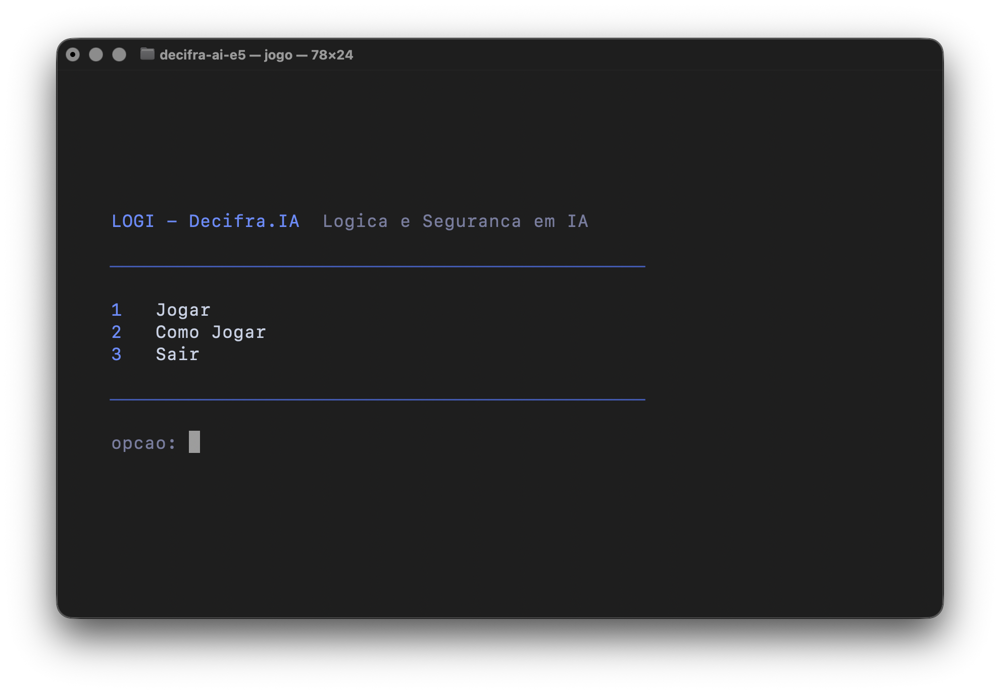

**Tela de inicialização**

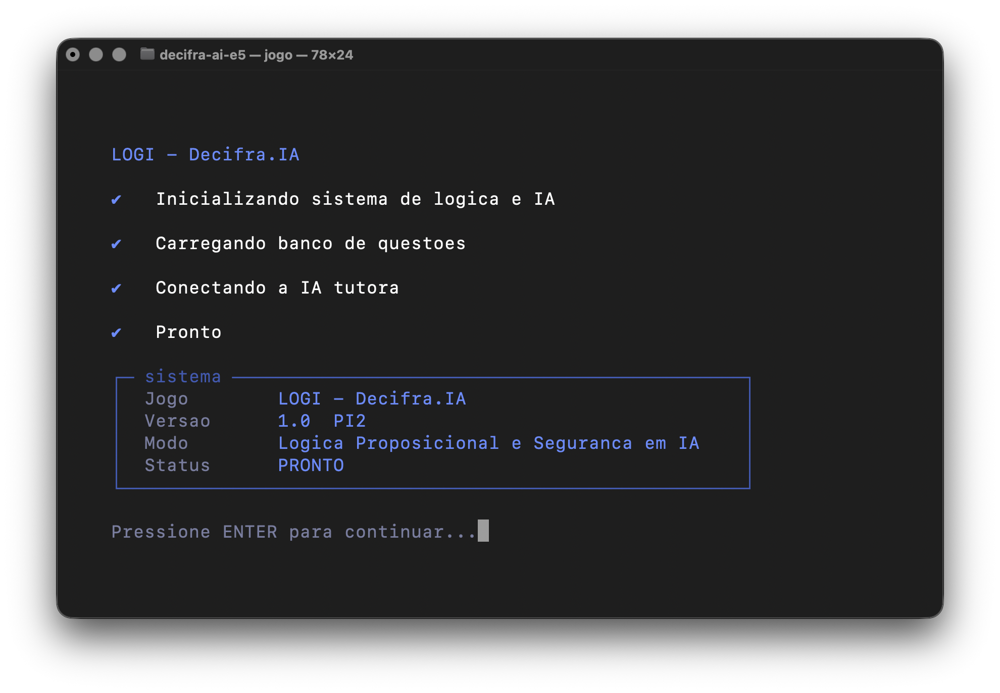

**Como Jogar**

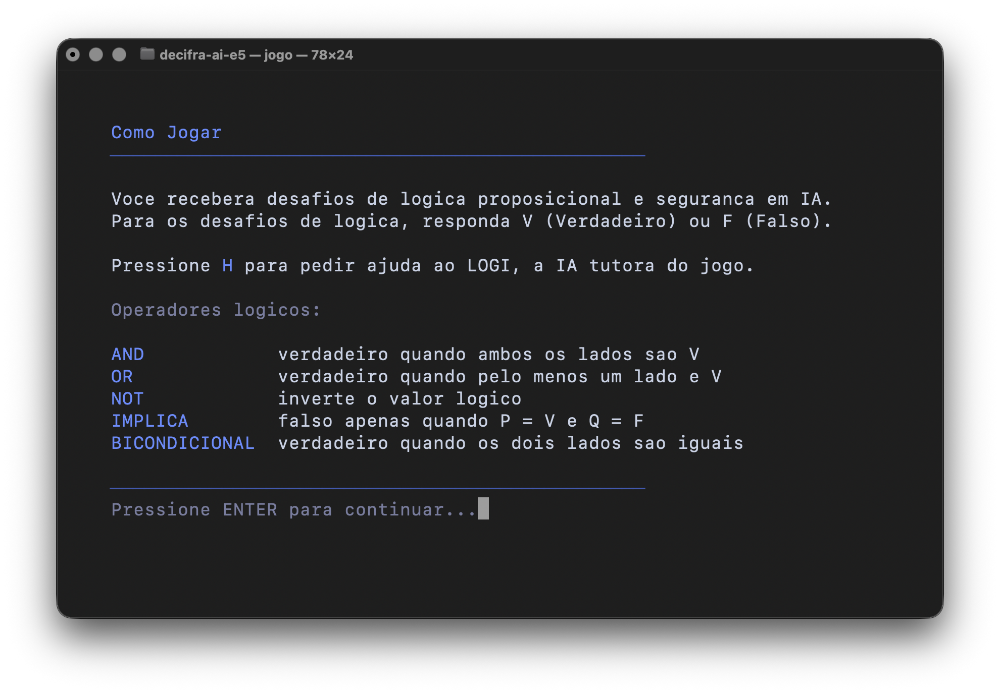

**Feedback de resposta correta**

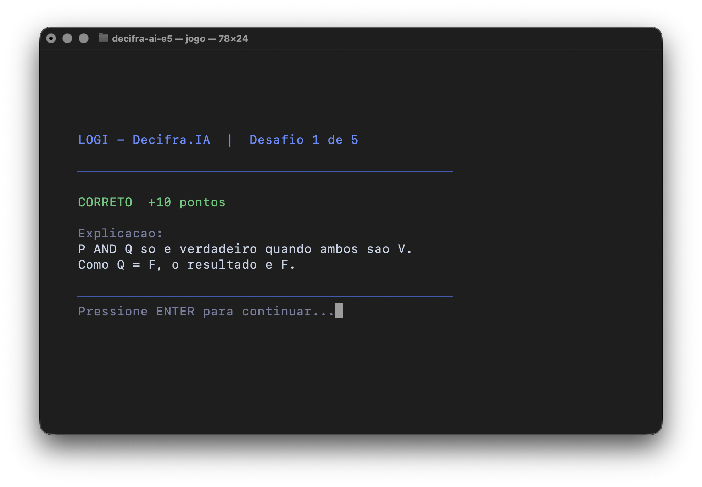

**Tutora LOGI — dica contextual**

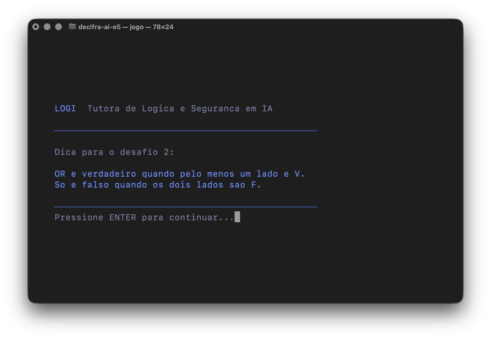

---

## Funcionalidades da UI

- **Alternate screen buffer** — o jogo roda como uma CLI isolada, sem rolar o terminal
- **Posicionamento absoluto de cursor** — nenhuma tela causa scroll; todo conteúdo é impresso em coordenadas fixas via `\033[row;colH`
- **Fade-in simultâneo em tela cheia** — todas as linhas aparecem juntas com brilho crescente via ANSI true-color RGB
- **Spinner braille animado** (⠋⠙⠹⠸⠼⠴⠦⠧⠇⠏ → ✔) nas telas de loading e saída
- **Paleta azul** derivada da identidade visual LOGI (#12122A em variantes mais claras)
- **Respostas V/F** sem diferenciação de maiúsculas/minúsculas
- **Sinal SIGINT capturado** — Ctrl+C restaura o terminal corretamente

---

## Equipe

| Integrante | Frente |
|---|---|
| Guilherme Alves de Souza | Gestão Ágil + Engenharia de Software |
| Hilton Resende | Gestão Ágil |
| João Guilherme Azevedo | Gestão Ágil |
| João Bezerra | Engenharia de Software |
| João Antonio Calazans | Design de Interação (IHC) |
| Pedro Feitosa | Lógica Matemática (LMC) |
| Ademir Pedro da Silva Filho | Motor em C (PIF) |
| Arthur Vieira Neiva Souza | Haskell (PIF) |
| Augusto Freitas Wanderley | Engenharia de Software |

---

## Estrutura do projeto

```
decifra-ai-e5/
├── src/
│   ├── main.c      # Ponto de entrada, loop principal, sinais
│   ├── game.c      # Lógica do jogo, desafios mockados, pontuação
│   ├── ui.c        # Todas as telas, animações, fade-in, paleta de cores
│   └── input.c     # Leitura de opção, nome e resposta V/F
├── include/
│   ├── game.h      # Structs Desafio e Jogador, constantes, protótipos
│   ├── ui.h        # Protótipos das telas
│   ├── input.h     # Protótipos de leitura
│   └── colors.h    # Constantes de cor ANSI (referência)
├── docs/
│   └── screenshots/  # Prints das telas do jogo
├── tests/          # Testes de unidade
└── Makefile        # Compilação do projeto em C
```

---

## Como compilar e rodar

### Pré-requisitos

- gcc
- make

### Instalação das dependências

**Ubuntu/Debian:**
```bash
sudo apt update
sudo apt install build-essential
```

**macOS:**
```bash
xcode-select --install
```

**Windows (recomendado usar WSL):**
```powershell
wsl --install
# Após reiniciar:
sudo apt update
sudo apt install build-essential
```

### Build e execução

```bash
make          # Compila
make run      # Compila e executa
make clean    # Limpa arquivos compilados
```

---

## Roadmap

- [x] Telas mockadas com navegação completa (UI Unidade 1)
- [x] Animações fade-in simultâneo com ANSI true-color
- [x] Spinner braille e alternate screen buffer
- [x] Posicionamento absoluto de cursor (sem scroll em nenhuma tela)
- [x] Integração com modelo LOGI (bridge C → Python + LoRA Qwen2.5-3B)
- [ ] Motor de lógica proposicional em Haskell (Unidade 2)
- [ ] Banco de questões expandido com geração via IA
- [ ] Modo narrativo com falas contextuais da LOGI
- [ ] Histórico de partidas e evolução do jogador

---

## Convenção de branches

| Branch | Uso |
|---|---|
| `main` | Código estável, entregas |
| `develop` | Integração contínua |
| `feat/nome` | Desenvolvimento de funcionalidades |

---

## Histórias de Usuário

https://docs.google.com/document/d/14-Qs1IytAIkQkP5Q3xof79yqZfvHkl9T4z30iwl_f30/edit?tab=t.0

### Diagramas de Fluxo (HU1 a HU10)

### HU1 - Proposições Compostas com o operador AND
<details>
  <summary>Clique para visualizar o Diagrama HU1</summary>
  
  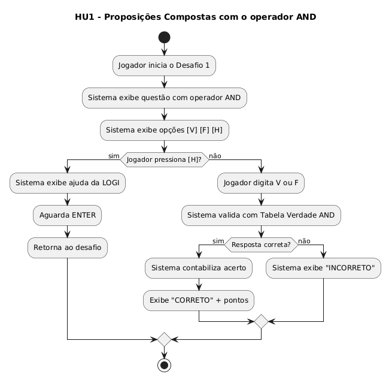
</details>

### HU2 - Conectivos Binários no Nível 1
<details>
  <summary>Clique para visualizar o Diagrama HU2</summary>
  
  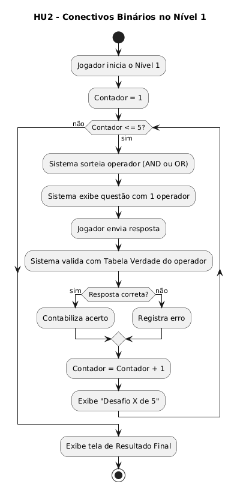
</details>

### HU3 - Fórmulas com Implicação e Bicondicional
<details>
  <summary>Clique para visualizar o Diagrama HU3</summary>
  
  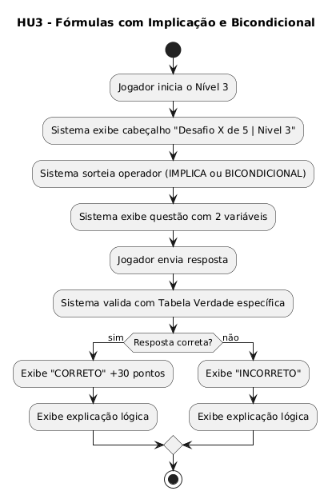
</details>

### HU4 - Feedback e Explicações Lógicas
<details>
  <summary>Clique para visualizar o Diagrama HU4</summary>
  
  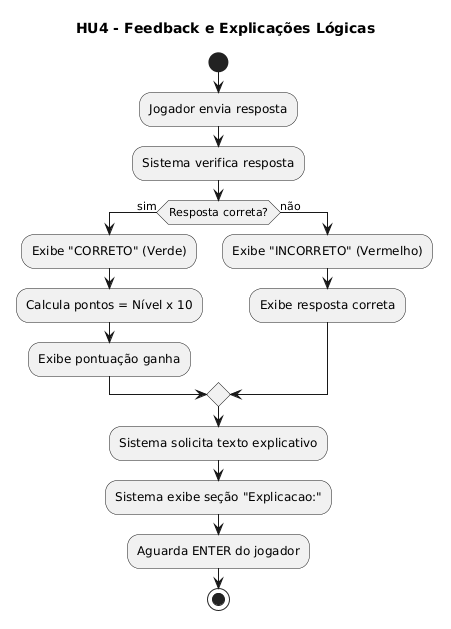
</details>

### HU5 - Regras de Progressão de Nível
<details>
  <summary>Clique para visualizar o Diagrama HU5</summary>
  
  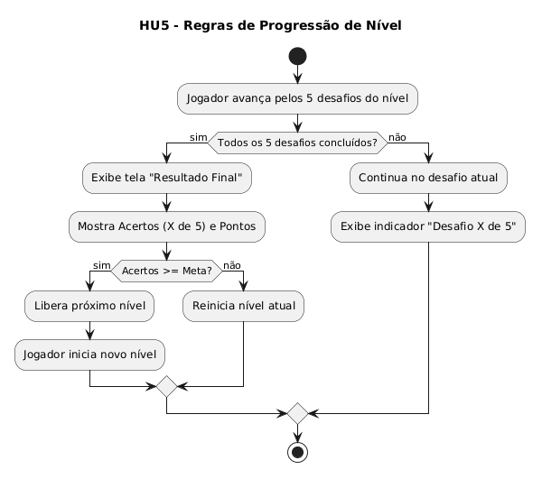
</details>

### HU6 - Notação Padronizada dos Operadores
<details>
  <summary>Clique para visualizar o Diagrama HU6</summary>
  
  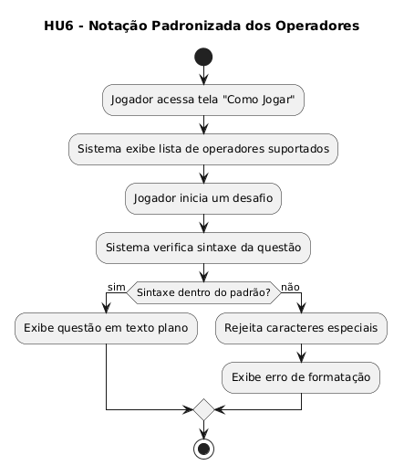
</details>

### HU7 - Precedência Lógica nos Enunciados
<details>
  <summary>Clique para visualizar o Diagrama HU7</summary>
  
  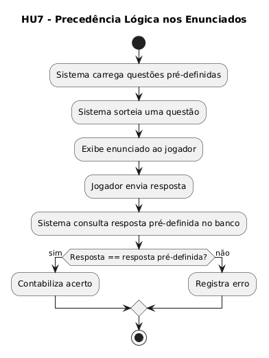
</details>

### HU8 - Sistema de Ajuda Contextual (Tutora LOGI)
<details>
  <summary>Clique para visualizar o Diagrama HU8</summary>
  
  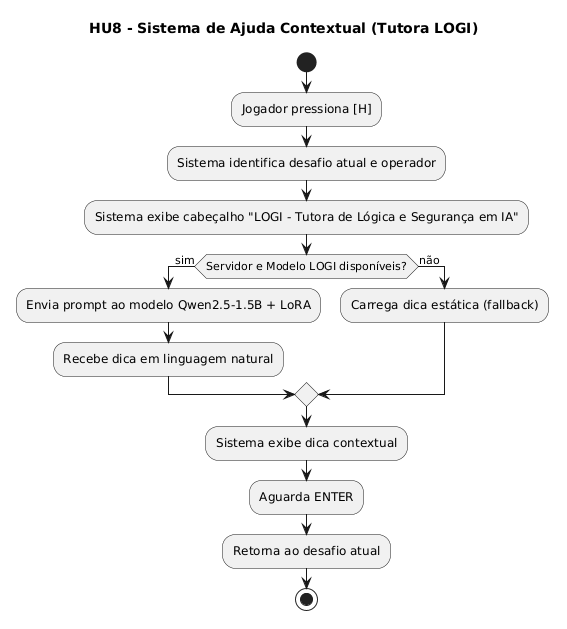
</details>

### HU9 - Exemplos Didáticos de Escopo
<details>
  <summary>Clique para visualizar o Diagrama HU9</summary>
  
  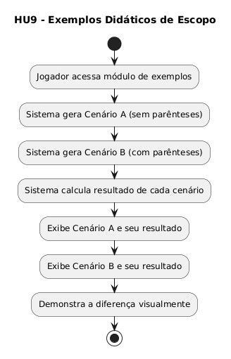
</details>

### HU10 - Cobertura de Combinações (2^n)
<details>
  <summary>Clique para visualizar o Diagrama HU10</summary>
  
  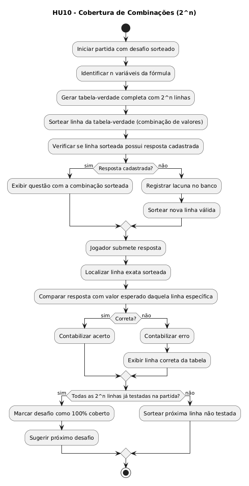
</details>

---

## Screencast

https://youtu.be/IIYWuKim7L0

### Protótipos e Telas do Jogo (Screenshots)
*(Como você já tem a pasta `screenshots`, pode adicionar os prints aqui também)*

| Tela | Descrição | Link |
| :--- | :--- | :--- |
| **01** | Menu Principal | [Ver Print](./docs/screenshots/01-menu-principal.png) |
| **02** | Como Jogar | [Ver Print](./docs/screenshots/02-como-jogar.png) |
| **03** | Inicialização | [Ver Print](./docs/screenshots/03-inicializacao.png) |
| **04** | Resposta Correta | [Ver Print](./docs/screenshots/04-resposta-correta.png) |
| **05** | Tutora LOGI | [Ver Print](./docs/screenshots/05-tutora-logi.png) |

## Backlog


---

## Board


---

## Licença

Projeto acadêmico - CESAR School 2026.
